# SQL Developer Reports 
SQL Developer reports for Oracle database version 12c+ tuning and more.

## Installation
1. Go to https://github.com/masked-devops/sql-developer-reports
2. Code -> Download ZIP -> Unzip the file locally.
3. Open SQL Developer.
4. View -> Reports
5. Right click on User Defined Reports -> Open Report... -> Select the file masked-devops.sql-developer-reports.xml

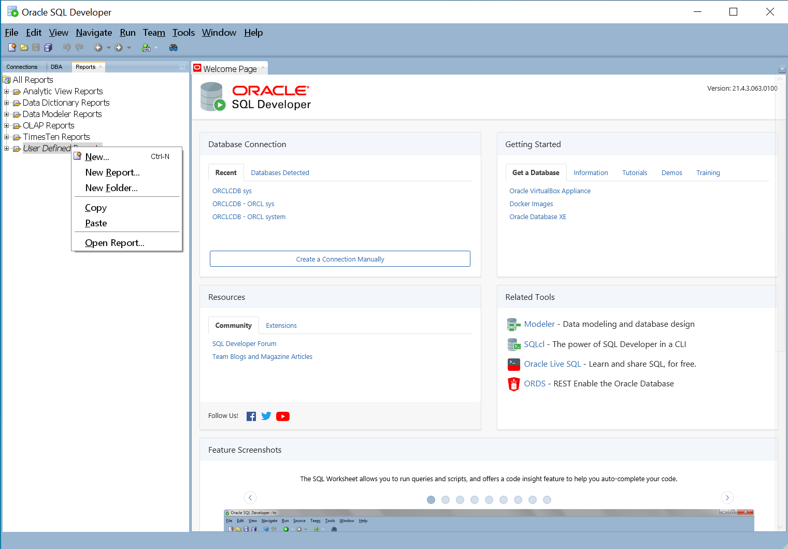

The database user needs the select_catalog_role privilege to run the reports.
    
    --Local User
    create user sqd identified by sqd;
    grant connect,select_catalog_role to sqd;

    --Common User
    create user c##_sqd identified by sqd container=all;
    grant connect,select_catalog_role to c##_sqd container=all;

## Documentation
Below the list of the reports, some of them require the Oracle Diagnostics Pack License.

* **Masked-Devops Session History**
  
    Database workload report on V$ACTIVE_SESSION_HISTORY and DBA_HIST_ACTIVE_SESS_HISTORY with details of all sessions samples
    
    Link to the documentaton [Masked-Devops Session History](doc/Masked-Devops-Session-History.md)
    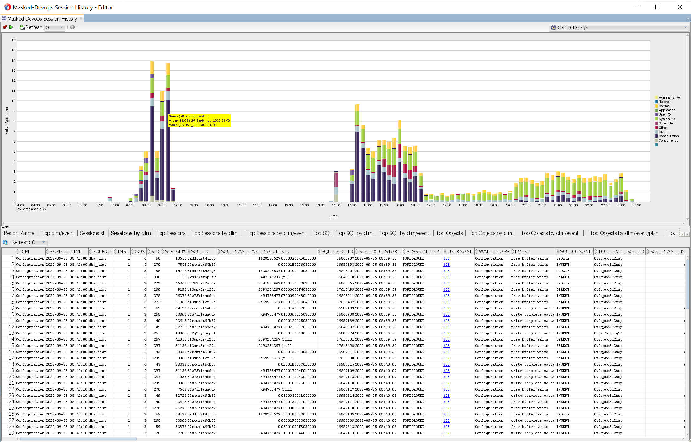

* **Masked-Devops SQL History**
  
    History of the sql execution plans, load plan baseline, load sql profile, AWR reports 
    
* **Masked-Devops AWR reports**
    
    Create AWR/ASH/ADDM reports files.
    
    Link to the documentaton 
    [Masked-Devops Session History](doc/Masked-Devops-AWR-Reports.md)
    
    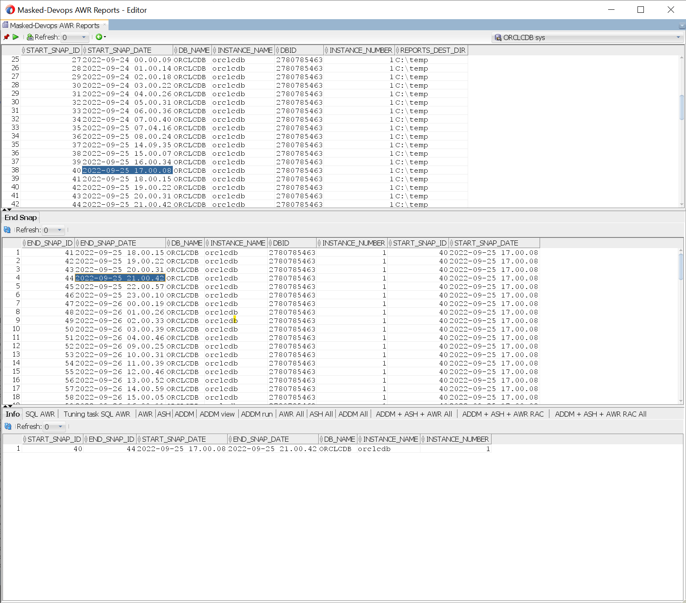

* **Masked-Devops AWR reports Time Model**
    
    Time model chart with View of the AWR/ASH/ADDM reports.
    
    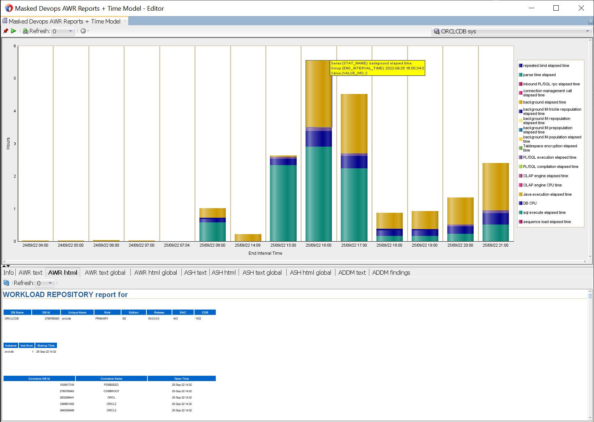

* **Masked Devops Session Browser**

    Browse Oracle sessions details
    
    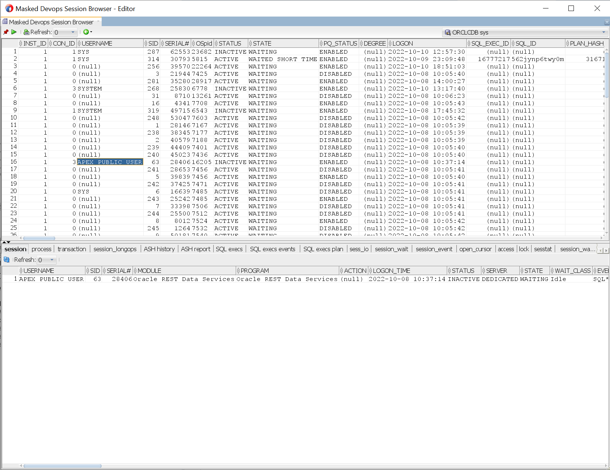

* **Masked-Devops CPU**
  
    Operating system and Database CPU reports
    
    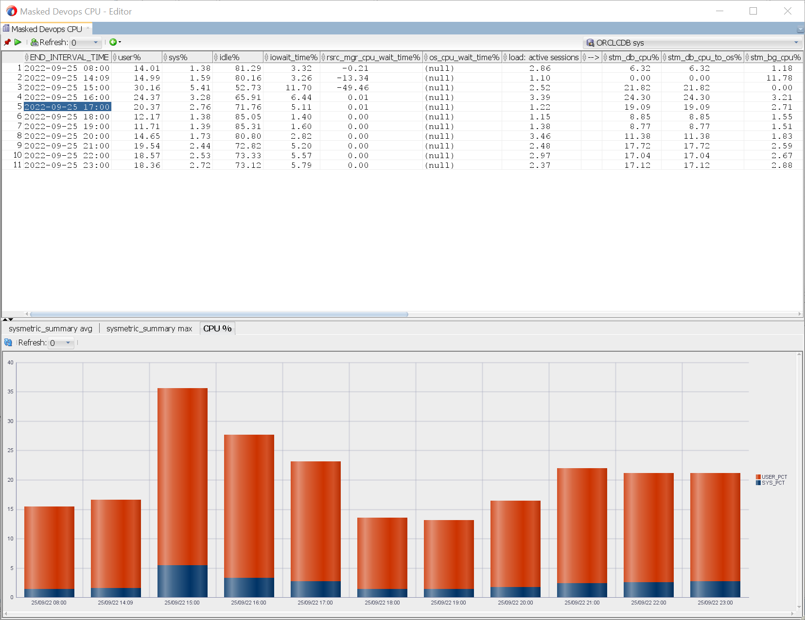

* **Masked-Devops I/O**
  
    Database I/O reports, IOPS, Throughput
    
    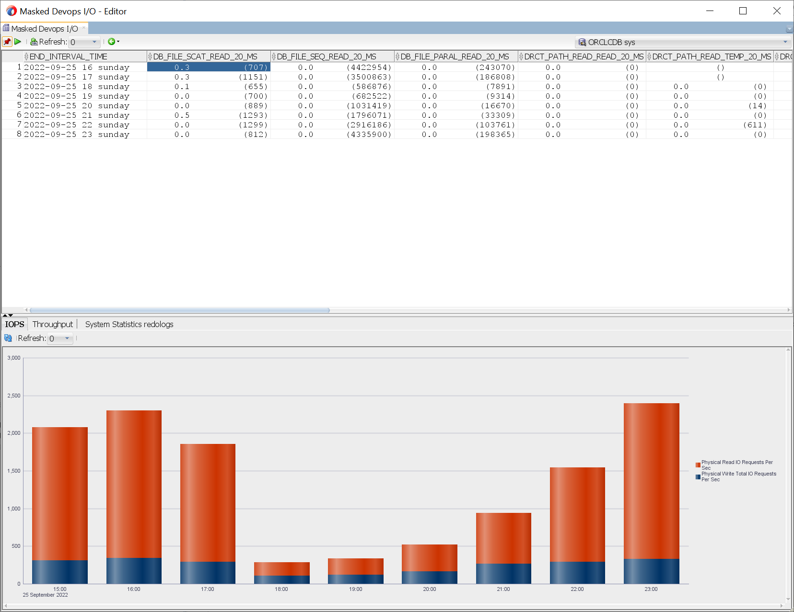

* **Masked-Devops Read Alert Log**
  
    Read the alert log and read the trace files content
    
    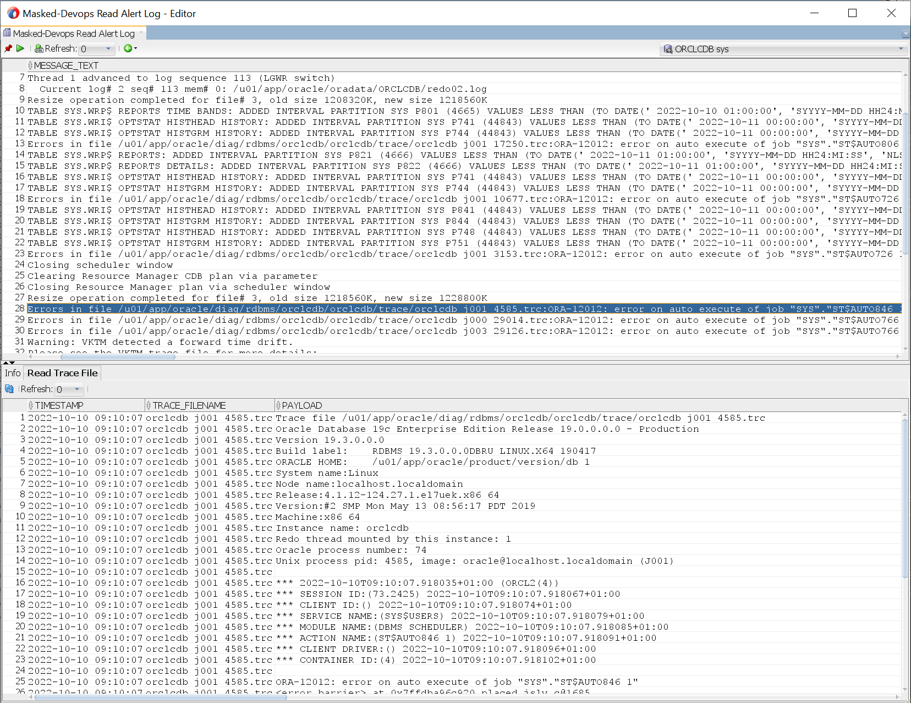

* **Masked-Devops Read Trace File**

    Read the trace files in Diag
    
    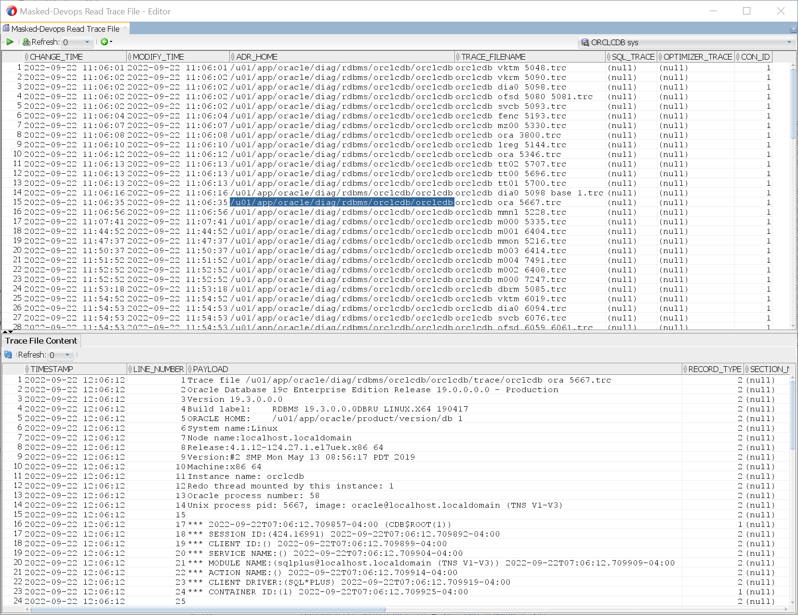

* **Masked-Devops AWR Sysstat**

    Chart reports on the sysstat statistics
    
    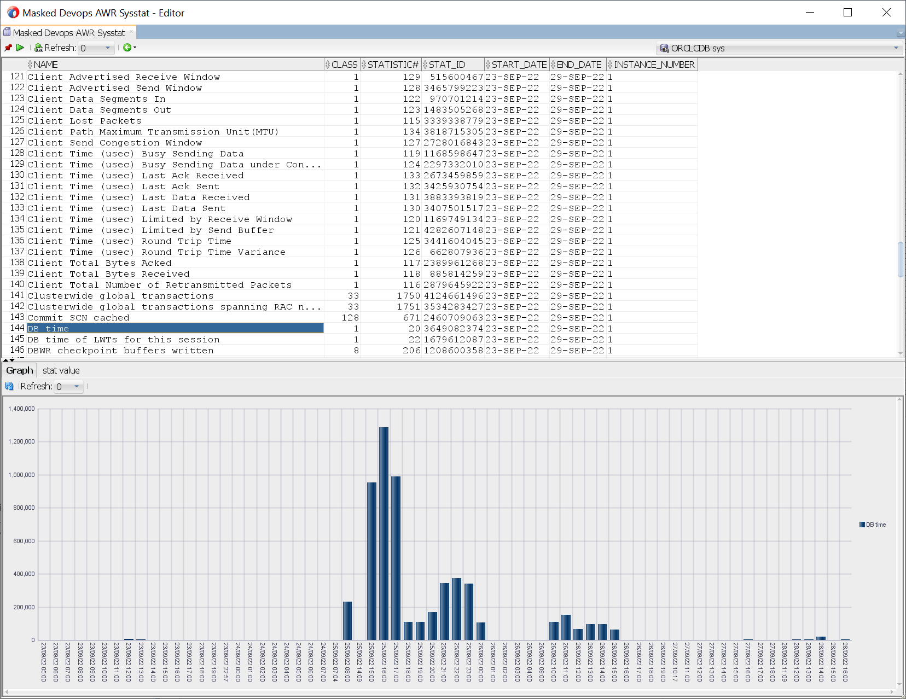

* **Masked-Devops Advisor reports**
    
    Read the Advisors reports
    
    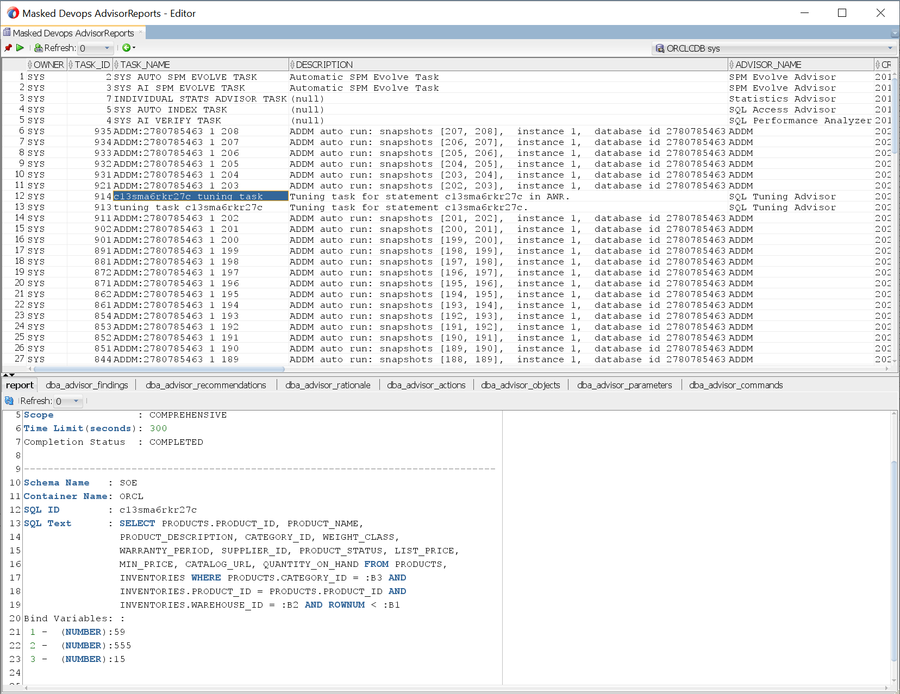
