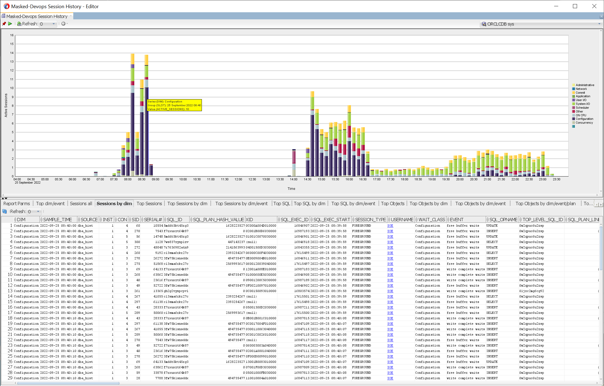

# Masked-Devops- Session History
The report is around two system views  [V$ACTIVE_SESSION_HISTORY](https://docs.oracle.com/en/database/oracle/oracle-database/19/refrn/V-ACTIVE_SESSION_HISTORY.html) (For the last 24hrs) and [DBA_HIST_ACTIVE_SESS_HISTORY](https://docs.oracle.com/en/database/oracle/oracle-database/19/refrn/DBA_HIST_ACTIVE_SESS_HISTORY.html).

Starting the report without specifying any parameter (All NULLs checked) will give you the last 24hrs, interval=600 seconds, dim=wait_class.

Clicking on the histogram will give details for the time slot in the child reports for the whole histogram or the dimension selected.

In the report below the blue part of the histogram for the time slot 8:40-8:50 has been selected, the child report "Sessions by Dim" shows all sessions samples for the dim "Configuration".

    start_date                  : 2022-09-25 06:00
    end_date                    : 2022-09-25 23:59
    

## Report Parameters

Parameters:

    start_date                  : yyyy-mm-dd hh24:mi   Default is sysdate-1  in that format
    end_date                    : yyyy-mm-dd hh24:mi   Default is sysdate    in that format
    interval                    : time slot in seconds, histogram width. Default 600
    dim                         : instance_number | con_id | user_id | session_sid | xid |
                                  sql_exec_id |  sql_exec_id_plan | sql_exec_id_plan_oper |
                                  sql_id | current_obj# | module |program | action | machine |
                                  event | wait_class.  Default wait_class

Filters:

    INST_ID                     : V$SESSION.inst_id
    CON_ID                      : V$SESSION.con_id
    SESSION_SID                 : V$SESSION.sid
    SESSION_SERIAL#             : V$SESSION.serial#
    SQL_ID                      : V$SESSION.sql_id
    SESSION_TYPE                : FOREGROUND/BACKGROUND  default=both
    USER_ID                     : V$SESSION.user#
    MODULE                      : V$SESSION.module
    PROGRAM                     : V$SESSION.program
    MACHINE                     : V$SESSION.machine
    WAIT_CLASS                  : Administrative/Application/Cluster/Commit/Concurrency/..
    PLSQL_ENTRY_OBJECT_ID       : DBA_OBJECTS.object_id
    DBA_HIST_ONLY               : yes|no, yes=only data from CDB_HIST_ACTIVE_SESS_HISTORY

### start_date/end_date 
They are the start/end of the samples timestamp in the two system views, if null is checked, their value will be sysdate-1/sysdate and all samples will be from V$ACTIVE_SESSION_HISTORY. By default, if the interval is in the last 24 hrs, the report will be on V$ACTIVE_SESSION_HISTORY, if the start time is older than 24 hrs, it will be on DBA_HIST_ACTIV   E_SESS_HISTORY, this behaviour can be changed with DBA_HIST_ONLY=yes ( valid only for reports in the last 24 hrs).

    start_date                  : 2022-09-25 04:00
    end_date                    : 2022-09-25 23:59

### interval
The width of the histograms report, the time interval in seconds of the samples.

    start_date                  : 2022-09-25 07:00
    end_date                    : 2022-09-25 09:00
    interval                    : 60

### dim
Dimension of the report, it will give a view of the report based on different columns.
Wokload per container, check which container is causing more load. In RAC "instance_number" will give the load per instance.

    start_date                  : 2022-09-25 14:00
    end_date                    : 2022-09-25 23:00
    interval                    : 600
    dim                         : con_id

Wokload per sql_id, check which sql_id is causing more load
    
    start_date                  : 2022-09-25 14:00
    end_date                    : 2022-09-25 23:00
    interval                    : 600
    dim                         : sql_id

Wokload per session_sid, check which session is causing more load
   
    start_date                  : 2022-09-25 14:00
    end_date                    : 2022-09-25 23:00
    interval                    : 600
    dim                         : session_sid

## Filters
Filters below can limit the rows of the report based on columns ov V$SESSION:
INST_ID
CON_ID
SESSION_SID
SESSION_SERIAL#
SQL_ID
SESSION_TYPE
USER_ID
MODULE
PROGRAM
MACHINE
WAIT_CLASS
PLSQL_ENTRY_OBJECT_ID
DBA_HIST_ONLY    

# Child Reports
Child reports provide the raw data from the system tables plus some top reports.
In the following examples dim=wait_class, the yellow part of the histogram at time 14:40 (14:40-14:50) is selected with dim value as "Configuration".

    start_date                  : 2022-09-25 14:00
    end_date                    : 2022-09-25 23:00
    interval                    : 600
    dim                         : wait_class
    

## Report Parms

List report parameters plus useful info about the instance and the slot selected.

    
## Top dim/event
Counts of the samples grouped by 

    slot(14:40-14:50)
    dim("Configuration")
    event

Columns:

    INST                    Instance number
    CON                     Container id
    TOTAL_WAIT_TIME_MS      Sum of wait time
    AVG_WAIT_TIME_MS        AWG wait time
    CNT_EVENT               Count of the samples grouped by dim("Configuration") and event
    CNT_ASH_CON             All samples in contained id for the slot(14:40-14:50)
    CNT_ASH_CON             All samples in the instance for the slot(14:40-14:50)
    LOAD_PCT_CON            Percent of the total load in the container, in the first line  125/243=51%
    LOAD_PCT_INST           Percent of the total load in the instance,  in the first line  125/417=29%  

## Sessions all
Raw data for all sessions in the interval selected 

    slot(14:40-14:50)

## Sessions by dim
Raw data for all sessions in the interval and dim selected 

    slot(14:40-14:50)
    dim("Configuration")

## Top Sessions
Counts of the samples grouped by: 

    slot(14:40-14:50)
    sid/serial.

## Top Sessions by dim
Counts of the samples grouped by: 

    slot(14:40-14:50)
    dim("Configuration")
    sid/serial.

## Top Sessions by dim/event
Counts of the samples grouped by: 

    slot(14:40-14:50)
    dim("Configuration")
    event
    sid/serial.

## Top SQL
Counts of the samples grouped by: 

slot(14:40-14:50)
    sql_id

## Top SQL by dim
## Top SQL by dim/event
## Top Objects
## Top Objects by dim
## Top Objects by dim/event
## Top Objects by dim/event/plan
## Top plan line
Counts of the samples grouped by: 

    slot(14:40-14:50)
    sql_id
    sql_plan_hash_value
    sql_plan_line_id
    

## Top Plan Line by dim
## Top plan line/object
## Top plan line/object by dim
## Top plan line/event by dim
## ASH text

It creates the ASH report for the slot(14:40-14:50) 

# Tips
Samples from one session only, sid=71	serial#=10164: 

    start_date                  : 2022-09-25 14:00
    end_date                    : 2022-09-25 23:00
    SESSION_SID                 : 71
    SESSION_SERIAL#             : 10164

Trace one session sql_id executions, sid=71	serial#=10164   sql_id=budtrjayjnvw3: 

    start_date                  : 2022-09-25 14:00
    end_date                    : 2022-09-25 23:00
    SESSION_SID                 : 71
    SESSION_SERIAL#             : 10164
    SQL_ID                      : budtrjayjnvw3

Samples from one user only USER_ID: 

    start_date                  : 2022-09-25 14:00
    end_date                    : 2022-09-25 23:00
    USER_ID                     : 139

Samples from one client server only: 

    start_date                  : 2022-09-25 14:00
    end_date                    : 2022-09-25 23:00
    MACHINE                     : appserver1

Samples from one plsql object only only: 

    start_date                  : 2022-09-25 14:00
    end_date                    : 2022-09-25 23:00
    PLSQL_ENTRY_OBJECT_ID       : 80316

