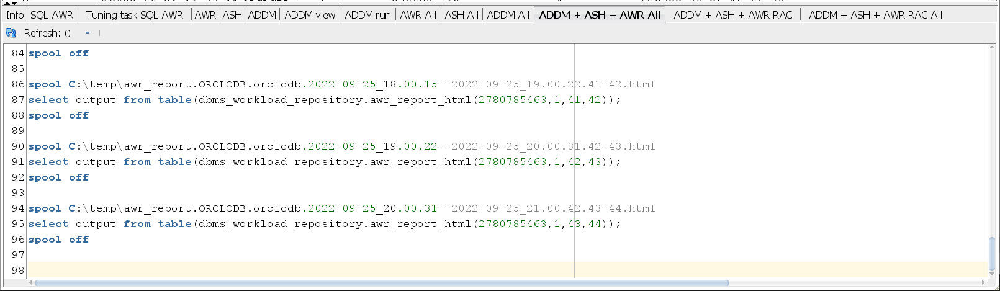

# Masked-Devops AWR reports

Chose the directory where the reports will be created

Chose the start snapshot

Chose the end snapshot

Chose the child, reports will be genetrated automatically

**Info**                         *Snapshot interval details*

**SQL AWR**                      *Tuning task SQL AWR* 

**AWR**                          *It creates the AWR html report*

**ASH**                          *It creates the AWR html report*

**ADDM**                         *It creates the ADDM text report*

**ADDM view**                    *View of the ADDM text report*

**ADDM run**                     *Run the ADDM text report*

**AWR All**                      *AWR reports for every snapshot in the interval*

**ASH All**                      *ASH reports for every snapshot in the interval*

**ADDM All**                     *ADDM reports for every snapshot in the interval*

**ADDM + ASH + AWR All**         *ADDM + ASH + AWR reports for every snapshot in the interval*

**ADDM + ASH + AWR RAC**         *ADDM + ASH + AWR RAC reports for start/end snapshot*

**ADDM + ASH + AWR RAC All**     *ADDM + ASH + AWR RAC reports for every snapshot in the interval*

